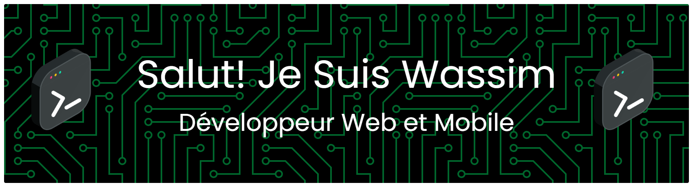

  

  💡 J’aime créer des applications modernes, rapides et élégantes  
  📱 Web | Mobile | UI/UX  
  ⚡ Toujours en train d’apprendre et d’innover

---

## 🧑‍💻 👨‍🚀 À propos de moi

- 🔭 Je travaille sur des projets **Web & Mobile**
- 🌱 J'améliore mes compétences en **Full Stack Development**
- 💬 Ask me about **Laravel, React, Mobile Apps**
- 🎯 Objectif : Devenir un développeur expert & créer des projets innovants
- ⚡ Fun fact : J’aime transformer les idées en applications réelles 🚀

---

## 🛠️ ⚙️ Technologies & Outils

### 💻 Frontend

  

### 🔧 Backend

  

### 📱 Mobile

  

### 🎨 Design & Tools

  

---

## 📊 📈 GitHub Stats

  

  

---

## 🌐 🤝 Connect with me

  
  

---

⭐️ From **Wassiml Machat** 🚀
